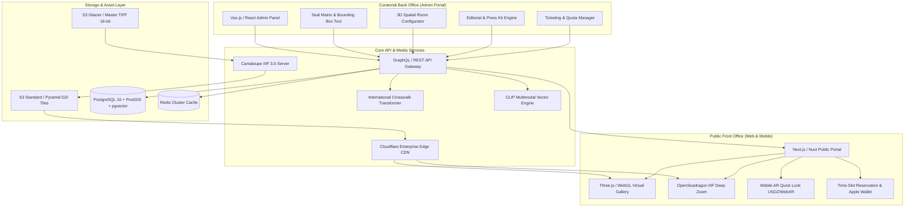

# System Architecture Overview

The platform uses a modern **Headless Architecture** decoupled into three main tiers:
1. **Curatorial Back-Office CMS** (Internal Management)
2. **Core API & IIIF Asset Processing Layer** (Microservices & CDN)
3. **Public Front Office** (Public Web Application & 3D Virtual Gallery)

---

## Architecture Diagram

---

## Technology Stack Specifications

| Layer | Recommended Technology | Key Purpose |
| :--- | :--- | :--- |
| **Back Office UI** | React / Vue 3 + TailwindCSS | Responsive administration portal with rich interactive tools. |
| **Public Frontend** | Next.js (React) / Nuxt (Vue) | Server-side rendering (SSR), SEO optimization, multi-lingual routing. |
| **3D Engine** | Three.js / WebGL / WebXR | Real-time 60 FPS 3D virtual gallery with custom PBR surface shaders. |
| **Deep Zoom Viewer** | OpenSeadragon 4.0+ / Mirador 3 | IIIF-compliant high-resolution deep zoom inspection. |
| **IIIF Image Server** | Cantaloupe 5.0+ | Dynamic pyramid tile generator supporting IIIF Image & Presentation API 3.0. |
| **Database** | PostgreSQL 16 + PostGIS + `pgvector` | Relational data, geographic locations of galleries, and AI vector embeddings. |
| **Caching & Queue** | Redis 7 + BullMQ | Fast session storage, cache invalidation, and ticket reservation locking. |
| **Edge CDN** | Cloudflare / AWS CloudFront | Global edge caching for gigapixel image tiles and static WebGL assets. |
