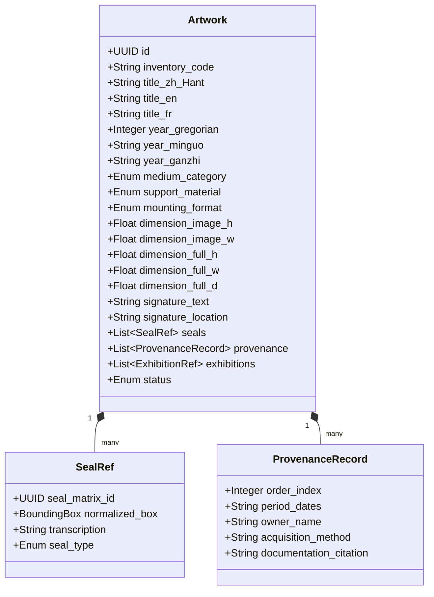

# Curatorial Back-Office (CMS & Administration)

The Back Office is the operational heart of the curatorial platform. It gives curators, archivists, registrars, and press officers fine-grained control over collection metadata, 3D exhibition layouts, editorial storytelling, and international exports.

---

## 1. Master Collection & Artwork Management (TMS / CMS)

### Core Features:
* **Multilingual Title & Inscription Fields**: Original Traditional Chinese (繁體中文), Wade-Giles / Pinyin romanizations, English, and French titles.
* **Dual Calendar Engine**: Automatic bidirectional conversion between Minguo Year (民國紀年), Gregorian Year, and Sexagenary Cycle (干支紀年).
* **Ink Medium & Mounting Picklists**: Controlled vocabularies for East Asian media (*水墨, 彩墨, 設色, 礦物顏料*) and mountings (*立軸, 橫披, 手卷, 鏡框, 冊頁, 屏風*).
* **Interactive Seal Annotation Tool**: Drag bounding boxes directly on gigapixel images to link detected seals to the authoritative Seal Matrix (印譜).
* **Provenance & Ownership Chronology**: Complete custodial history tracking acquisitions, gallery consignments, and institutional donations.

---

## 2. 3D Virtual Gallery Builder & Spatial Curator

* **Spatial Room Configurator**:
  * Select from pre-built 3D room templates (Minimalist White Cube, Historic Courtyard Hall, Industrial Loft, Dark Ambient Room) or upload custom `.glb` models.
  * Drag-and-drop artwork placement on virtual walls with millimeter-accurate real-world scaling based on database dimensions.
  * Lighting Studio: Configure spotlight angles, beam width, color temperature (3000K–5000K), and floor reflections.
* **Curatorial Guided Tour Sequence**:
  * Waypoint editor: Place camera waypoints to script automated virtual walkthroughs.
  * Localized audio commentary tracks (Mandarin, English, French) triggered at specific stops.
  * In-scene didactic elements: 3D vinyl wall text, introductory panels, and video screens.

---

## 3. News, Editorial & Media Relations Engine

* **Curatorial Storytelling CMS**:
  * Block editor with embedded IIIF deep-zoom widgets, split-screen comparisons, and audio-visual archives.
  * Category hierarchy: *Exhibitions*, *Press Releases*, *Curatorial Essays*, *Monographs*, *Videos & Talks*.
* **Digital Press Room & Media Kit Generator**:
  * One-click media kit bundler: Generates downloadable `.zip` packages with high-resolution press images (with caption/credit sheets) and PDF press releases.
  * Embargo scheduler for timed press releases and password-protected preview links for accredited journalists.

---

## 4. Partner Galleries & Physical Venue Management

* **Global Gallery Directory**:
  * Manage profiles, opening hours, and contact details for collaborating galleries and institutions (e.g., Eslite Gallery 誠品畫廊, Kaohsiung Museum of Fine Arts, Art Basel).
  * Synchronization with Mapbox / Google Maps geolocation.
* **Consignment & Loan Tracking**:
  * Real-time location tracker for artworks currently on loan, in transit, or consigned to external partners.

---

## 5. Ticketing, Booking & Access Control Hub

* **Time-Slot Reservation Engine**:
  * Quota and capacity management per time slot.
  * Integration hooks for external ticketing platforms (**Tessitura, Eventbrite, SecuTix, Stripe, Tiqets, Accupass / 活動通**).
* **VIP Private Viewing Rooms (PVR)**:
  * Access keys and tokenized invite links for high-value collectors with visitor engagement analytics (time spent, zoom depth).

---

## 6. Security, RBAC & Multi-Lingual Architecture

* **Role-Based Access Control (RBAC)**: Fine-grained permissions for Chief Curators, Registrars, Press Officers, 3D Spatial Designers, and Admin Staff.
* **Multilingual Localization**: Native support for Traditional Chinese (繁體中文), English, and French.
