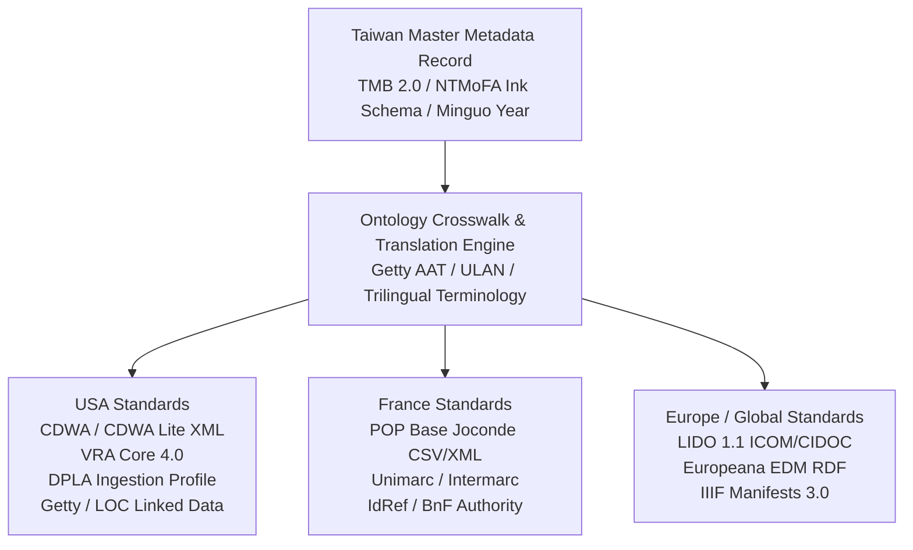
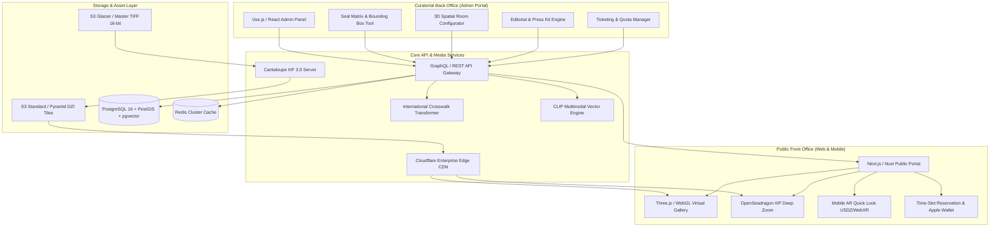
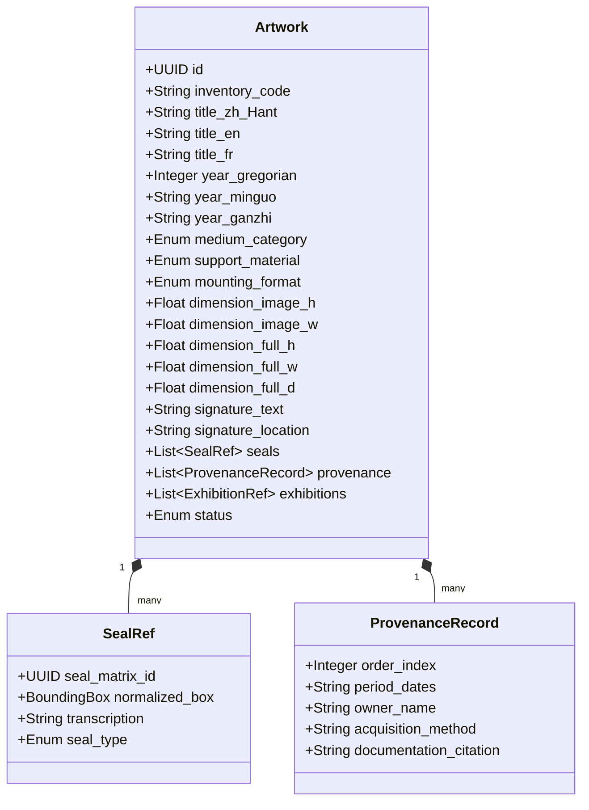
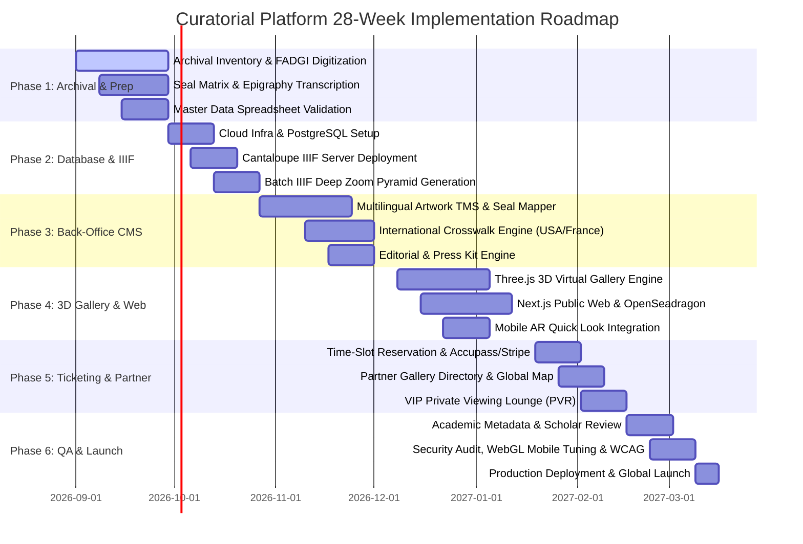

# Museum-Grade Art Curating Platform: Architecture & Feature Specifications
*(Customized for Taiwanese Modern & Ink Art with International Export Pipelines)*

A comprehensive, production-ready specification for a museum-grade art curating platform engineered to conform with **Taiwanese cultural heritage metadata standards (Ministry of Culture, NTMoFA, TMB 2.0)**, equipped with an automated **Crosswalk & Export Engine for International Standards (USA: CDWA/VRA/DPLA, France/Europe: POP Joconde/LIDO/EDM)**, and powering an immersive public front office (virtual 3D gallery, IIIF deep zoom explorer, editorial room, partner gallery network, and ticketing integrations).

---

## Table of Contents
1. [Cultural Heritage Standards: Taiwan & International Ecosystem](#1-cultural-heritage-standards-taiwan--international-ecosystem)
   - [1.1 Taiwan National Cultural Standards & Art Conventions](#11-taiwan-national-cultural-standards--art-conventions)
   - [1.2 International Standard Export Pipelines (USA & France / Europe)](#12-international-standard-export-pipelines-usa--france--europe)
   - [1.3 Benchmark Examples from World-Class Institutions](#13-benchmark-examples-from-world-class-institutions)
2. [System Architecture & Data Crosswalk Pipeline](#2-system-architecture--data-crosswalk-pipeline)
3. [Backend & Back-Office (Curatorial CMS & Administration)](#3-backend--back-office-curatorial-cms--administration)
   - [3.1 Collection & Artwork Management (Taiwanese Art & Epigraphy Aware)](#31-collection--artwork-management-taiwanese-art--epigraphy-aware)
   - [3.2 International Standard Export & Crosswalk Engine](#32-international-standard-export--crosswalk-engine)
   - [3.3 3D Virtual Gallery Builder & Spatial Curator](#33-3d-virtual-gallery-builder--spatial-curator)
   - [3.4 News, Editorial & Media Relations Engine](#34-news-editorial--media-relations-engine)
   - [3.5 Partner Galleries & Physical Venue Management](#35-partner-galleries--physical-venue-management)
   - [3.6 Ticketing, Booking & Access Control Hub](#35-ticketing-booking--access-control-hub)
   - [3.7 Inquiries, Commerce & Verifiable Certificate of Authenticity (COA)](#37-inquiries-commerce--verifiable-certificate-of-authenticity-coa)
   - [3.8 Security, RBAC & Multi-Lingual Architecture](#38-security-rbac--multi-lingual-architecture)
4. [Frontend & Front-Office (Public Facing Experience)](#4-frontend--front-office-public-facing-experience)
   - [4.1 Immersive Virtual Gallery & 3D Viewing Rooms (WebGL / WebXR)](#41-immersive-virtual-gallery--3d-viewing-rooms-webgl--webxr)
   - [4.2 Collection Explorer & Deep Zoom (IIIF 3.0 Multi-Language)](#42-collection-explorer--deep-zoom-iiif-30-multi-language)
   - [4.3 Editorial & News Center](#43-editorial--news-center)
   - [4.4 Partner Gallery & Physical Exhibition Hub](#44-partner-gallery--physical-exhibition-hub)
   - [4.5 Seamless Pre-Order Ticket & RSVP Interface](#45-seamless-pre-order-ticket--rsvp-interface)
   - [4.6 Artist Biography, Timeline & Catalogue Raisonné](#46-artist-biography-timeline--catalogue-raisonné)
   - [4.7 Collector Inquiries & Private Viewing Rooms (PVR)](#47-collector-inquiries--private-viewing-rooms-pvr)
5. [Prerequisites for Database Accuracy & Platform Engineering](#5-prerequisites-for-database-accuracy--platform-engineering)
   - [5.1 Archival, Digitization & Curatorial Prerequisites](#51-archival-digitization--curatorial-prerequisites)
   - [5.2 Metadata Ingestion & Database Schema Prerequisites](#52-metadata-ingestion--database-schema-prerequisites)
   - [5.3 Technical, Cloud & Third-Party Service Prerequisites](#53-technical-cloud--third-party-service-prerequisites)
6. [Step-by-Step Project Management & Implementation Plan](#6-step-by-step-project-management--implementation-plan)
   - [6.1 Project Phasing & Timeline (28-Week Schedule)](#61-project-phasing--timeline-28-week-schedule)
   - [6.2 Work Breakdown Structure (WBS) & Role Matrix](#62-work-breakdown-structure-wbs--role-matrix)
   - [6.3 Quality Gates & Risk Mitigation Strategies](#63-quality-gates--risk-mitigation-strategies)
7. [Proposed Strategic Improvements & Innovations](#7-proposed-strategic-improvements--innovations)

---
# Cultural Heritage Standards & International Crosswalk Engine

The curating platform natively integrates **Taiwanese cultural heritage data standards** while providing an automated **Ontology Crosswalk & Export Engine** for major international museum repositories in the **United States** and **France / Europe**.

---

## 1. Taiwan National Cultural Standards & Art Conventions

Because the platform represents Taiwanese modern and contemporary ink masters (such as **Lee An-cheng 李安成**), the core database schema complies with Taiwan Ministry of Culture guidelines and traditional East Asian cataloging ontologies:

### Key Taiwan Standards
* **Taiwan Cultural Memory Bank 2.0 (國家文化記憶庫 2.0 - TMB / 文化部 MOC)**:
  * Full schema compliance for cultural artifact description, metadata exchange, OpenAPI interoperability, and standard Taiwanese Public Cultural Licensing / Creative Commons frameworks.
* **TELDAP (數位典藏與數位學習國家型科技計畫) Metadata Standards**:
  * Adherence to Taiwan’s foundational National Digital Archives guidelines for visual arts and calligraphy metadata structures.
* **Museum of Fine Arts Cataloging Frameworks (NTMoFA 國美館 / TFAM 北美館 / KMFA 高美館)**:
  * **Medium & Support Taxonomy**: Native classification for 水墨 (Ink and wash), 彩墨 (Color and ink), 設色 (Color wash), 礦物顏料 (Mineral pigments), 宣紙 (Xuan paper), 棉紙 (Cotton paper), 絹本 (Silk), 複合媒材 (Mixed media).
  * **Mounting & Format Typology (裝裱形制)**: 條幅/立軸 (Hanging scroll), 橫披 (Horizontal scroll), 手卷 (Handscroll), 鏡框/鏡心 (Framed / mounted core), 冊頁 (Album leaf), 屏風 (Folding screen), 捲軸 (Rolled scroll).
  * **Epigraphy, Inscriptions & Seals (款識與印章)**:
    * Inscription transcriptions (題款/詩跋), calligraphy script styles (行草, 隸書, 楷書), and normalized coordinate location mapping.
    * Seal imprint records (鈐印): Distinction between 朱文 (Yang/Relief seal) and 白文 (Yin/Intaglio seal), Name seals (姓名印), Pseudonym/Studio seals (字號印), and Leisure/Aesthetic seals (閒章/押角章).
  * **Dual Calendar System**: Native indexing supporting Taiwanese Minguo Era (民國年, e.g., 民國69年), Gregorian Solar Year (1980), and Sexagenary Cycle (干支紀年, e.g., 庚申年).
  * **Authority Control & Romanization**:
    * Dual Romanization mapping: Wade-Giles (*Lee An-cheng* / *Li An-cheng*) $\leftrightarrow$ Hanyu Pinyin (*Lǐ Ānchéng*) $\leftrightarrow$ Traditional Chinese (*李安成*).
    * Linked authority URIs with the **National Central Library Authority Database (國家圖書館權威檔)** and **Academia Sinica Center for Digital Cultures (中研院數位文化中心 CCC)**.

---

## 2. International Standard Export Pipelines (USA & France / Europe)

The platform features an automated **Crosswalk Transformation Engine** that converts Taiwan-native curatorial records into international museum formats at the touch of a button:

### A. Export to United States (USA) Standards
* **CDWA & CDWA Lite (Categories for the Description of Works of Art - Getty/Smithsonian)**:
  * Maps Taiwanese physical descriptions, measurements, and inscriptions to standard Getty CDWA XML elements (`cdwalite:indexingMaterialsTech`, `cdwalite:inscriptions`, `cdwalite:provenanceDescription`).
* **VRA Core 4.0 (Visual Resources Association)**:
  * Full XML export for US academic and museum visual resource centers, packaging work records, image surrogate records, and collection relationships.
* **DPLA Ingestion Format (Digital Public Library of America)**:
  * Qualified Dublin Core (QDC) export ready for harvesting by US national cultural aggregators.
* **Getty Vocabularies & US Library of Congress Alignment**:
  * Automated term reconciliation mapping Chinese medium/format concepts to Getty AAT URIs (e.g., 立軸 $\rightarrow$ AAT `300015012` [hanging scrolls]; 水墨 $\rightarrow$ AAT `300053271` [ink wash]).

### B. Export to France & European Standards
* **POP - Base Joconde (Ministère de la Culture, France)**:
  * Automated generation of official French museum inventory records following the *Joconde* cataloging syntax:
    * `AUTR` (Auteur / Artist): *LEE An-cheng (李安成)*
    * `TITR` (Titre de l'œuvre): Translated French title & romanized original
    * `DENO` (Dénomination): *Peinture / Rouleau vertical* (Hanging scroll)
    * `TECH` (Techniques & Matériaux): *Encre de Chine et couleur sur papier de riz (Xuan)*
    * `DIM` (Dimensions): *H. en cm ; L. en cm*
    * `PERI` (Époque / Période): *4e quart 20e siècle (1980)*
    * `INS` (Inscriptions / Signatures): Transcribed and translated artist seals (*Sceau de l'artiste en bas à droite*)
    * `STAT` (Statut juridique): Ownership, copyright, and inventory number.
* **LIDO 1.1 (Lightweight Information Describing Objects - ICOM / CIDOC)**:
  * The international XML harvesting standard for European museum portals and Franco-German digital archives.
* **Europeana Data Model (EDM)**:
  * Semantic RDF/XML and JSON-LD data structure ready for direct ingestion into the European cultural platform **Europeana**.
* **IdRef & BnF (Bibliothèque nationale de France) Identifier Linking**:
  * Semantic links to French national authority files and international ISNI/ORCID identifiers.

---

## 3. Trilingual Terminology Crosswalk Reference

| Chinese Term (Traditional) | English Museum Equivalent | French Equivalent (*Base Joconde*) | Getty AAT URI |
| :--- | :--- | :--- | :--- |
| **水墨 (水墨畫)** | Ink wash / Chinese ink painting | Peinture à l'encre de Chine | `aat:300053271` |
| **水墨設色 / 彩墨** | Ink and color on paper | Encre et couleurs sur papier | `aat:300053271` |
| **立軸 / 條幅** | Hanging scroll | Rouleau vertical / Kakemono | `aat:300015012` |
| **橫披** | Horizontal scroll | Rouleau horizontal | `aat:300189808` |
| **手卷** | Handscroll | Rouleau portatif / Makimono | `aat:300015014` |
| **鏡心 / 鏡框** | Mounted in frame / Unmounted core | Peinture montée sous cadre | `aat:300055644` |
| **冊頁** | Album leaf | Feuille d'album | `aat:300027354` |
| **朱文姓名印** | Artist relief seal (Zhuwen) | Sceau nominatif de l'artiste en relief | `aat:300028744` |
| **白文印** | Intaglio seal (Baiwen) | Sceau en creux (caractères blancs) | `aat:300028744` |
| **宣紙** | Xuan paper / Rice paper | Papier de riz (Xuan) | `aat:300014163` |

---

# System Architecture Overview

The platform uses a modern **Headless Architecture** decoupled into three main tiers:
1. **Curatorial Back-Office CMS** (Internal Management)
2. **Core API & IIIF Asset Processing Layer** (Microservices & CDN)
3. **Public Front Office** (Public Web Application & 3D Virtual Gallery)

---

## Architecture Diagram

---

## Technology Stack Specifications

| Layer | Recommended Technology | Key Purpose |
| :--- | :--- | :--- |
| **Back Office UI** | React / Vue 3 + TailwindCSS | Responsive administration portal with rich interactive tools. |
| **Public Frontend** | Next.js (React) / Nuxt (Vue) | Server-side rendering (SSR), SEO optimization, multi-lingual routing. |
| **3D Engine** | Three.js / WebGL / WebXR | Real-time 60 FPS 3D virtual gallery with custom PBR surface shaders. |
| **Deep Zoom Viewer** | OpenSeadragon 4.0+ / Mirador 3 | IIIF-compliant high-resolution deep zoom inspection. |
| **IIIF Image Server** | Cantaloupe 5.0+ | Dynamic pyramid tile generator supporting IIIF Image & Presentation API 3.0. |
| **Database** | PostgreSQL 16 + PostGIS + `pgvector` | Relational data, geographic locations of galleries, and AI vector embeddings. |
| **Caching & Queue** | Redis 7 + BullMQ | Fast session storage, cache invalidation, and ticket reservation locking. |
| **Edge CDN** | Cloudflare / AWS CloudFront | Global edge caching for gigapixel image tiles and static WebGL assets. |

---

# Curatorial Back-Office (CMS & Administration)

The Back Office is the operational heart of the curatorial platform. It gives curators, archivists, registrars, and press officers fine-grained control over collection metadata, 3D exhibition layouts, editorial storytelling, and international exports.

---

## 1. Master Collection & Artwork Management (TMS / CMS)

### Core Features:
* **Multilingual Title & Inscription Fields**: Original Traditional Chinese (繁體中文), Wade-Giles / Pinyin romanizations, English, and French titles.
* **Dual Calendar Engine**: Automatic bidirectional conversion between Minguo Year (民國紀年), Gregorian Year, and Sexagenary Cycle (干支紀年).
* **Ink Medium & Mounting Picklists**: Controlled vocabularies for East Asian media (*水墨, 彩墨, 設色, 礦物顏料*) and mountings (*立軸, 橫披, 手卷, 鏡框, 冊頁, 屏風*).
* **Interactive Seal Annotation Tool**: Drag bounding boxes directly on gigapixel images to link detected seals to the authoritative Seal Matrix (印譜).
* **Provenance & Ownership Chronology**: Complete custodial history tracking acquisitions, gallery consignments, and institutional donations.

---

## 2. 3D Virtual Gallery Builder & Spatial Curator

* **Spatial Room Configurator**:
  * Select from pre-built 3D room templates (Minimalist White Cube, Historic Courtyard Hall, Industrial Loft, Dark Ambient Room) or upload custom `.glb` models.
  * Drag-and-drop artwork placement on virtual walls with millimeter-accurate real-world scaling based on database dimensions.
  * Lighting Studio: Configure spotlight angles, beam width, color temperature (3000K–5000K), and floor reflections.
* **Curatorial Guided Tour Sequence**:
  * Waypoint editor: Place camera waypoints to script automated virtual walkthroughs.
  * Localized audio commentary tracks (Mandarin, English, French) triggered at specific stops.
  * In-scene didactic elements: 3D vinyl wall text, introductory panels, and video screens.

---

## 3. News, Editorial & Media Relations Engine

* **Curatorial Storytelling CMS**:
  * Block editor with embedded IIIF deep-zoom widgets, split-screen comparisons, and audio-visual archives.
  * Category hierarchy: *Exhibitions*, *Press Releases*, *Curatorial Essays*, *Monographs*, *Videos & Talks*.
* **Digital Press Room & Media Kit Generator**:
  * One-click media kit bundler: Generates downloadable `.zip` packages with high-resolution press images (with caption/credit sheets) and PDF press releases.
  * Embargo scheduler for timed press releases and password-protected preview links for accredited journalists.

---

## 4. Partner Galleries & Physical Venue Management

* **Global Gallery Directory**:
  * Manage profiles, opening hours, and contact details for collaborating galleries and institutions (e.g., Eslite Gallery 誠品畫廊, Kaohsiung Museum of Fine Arts, Art Basel).
  * Synchronization with Mapbox / Google Maps geolocation.
* **Consignment & Loan Tracking**:
  * Real-time location tracker for artworks currently on loan, in transit, or consigned to external partners.

---

## 5. Ticketing, Booking & Access Control Hub

* **Time-Slot Reservation Engine**:
  * Quota and capacity management per time slot.
  * Integration hooks for external ticketing platforms (**Tessitura, Eventbrite, SecuTix, Stripe, Tiqets, Accupass / 活動通**).
* **VIP Private Viewing Rooms (PVR)**:
  * Access keys and tokenized invite links for high-value collectors with visitor engagement analytics (time spent, zoom depth).

---

## 6. Security, RBAC & Multi-Lingual Architecture

* **Role-Based Access Control (RBAC)**: Fine-grained permissions for Chief Curators, Registrars, Press Officers, 3D Spatial Designers, and Admin Staff.
* **Multilingual Localization**: Native support for Traditional Chinese (繁體中文), English, and French.

---

# Public Front Office & 3D Virtual Gallery

The Front Office provides a responsive, museum-grade web interface for art lovers, researchers, institutions, and collectors.

---

## 1. Immersive Virtual Gallery (WebGL / WebXR)

* **Real-Time 3D Navigation**:
  * 60+ FPS navigation powered by Three.js with WASD / Touch Joystick / Click-to-teleport controls.
  * "True-to-Scale" visual representation: Paintings are rendered according to their real-world millimeter dimensions relative to ambient room height and viewer perspective.
* **Artwork Focus Mode**:
  * Clicking an artwork transitions the camera smoothly to a front-on view with dynamic spotlights, bilingual wall labels, and an audio guide player.
* **Spatial Audio Guide**:
  * 3D positional audio narration that shifts dynamically in volume and stereo pan as visitors move through the exhibition.
* **Augmented Reality (AR) "View on Your Wall"**:
  * Instant 1:1 scale preview on iOS Safari (via Apple AR Quick Look `.usdz`) and Android Chrome (via WebXR Scene Viewer).

---

## 2. Collection Explorer & IIIF Deep Zoom

* **OpenSeadragon / Mirador Deep Zoom Viewer**:
  * Seamless gigapixel examination of brushstrokes, Xuan paper texture, ink bleed, and seal impressions without latency.
* **Faceted Search & Chronological Filter**:
  * Interactive timeline slider (e.g., 1900 to 2010), Minguo era filter, medium, theme, and dominant color palette extractor.
* **Dual Artwork Comparative Mode**:
  * Synchronized side-by-side zoom comparing two paintings from different creative periods.

---

## 3. Editorial & News Room

* **Curatorial Stories & Scholarly Essays**:
  * Long-form scholarly essays with sticky side-by-side artwork references and interactive footnotes.
* **Press & Media Hub**:
  * Filterable press releases with direct media kit downloads and press accreditation forms.

---

## 4. Partner Gallery & Physical Exhibition Hub

* **Interactive Global Map**:
  * World map displaying active and upcoming exhibitions across collaborating galleries.
  * Action buttons: *"View Gallery Profile"*, *"Get Directions"*, *"Inquire on Artworks at this Location"*.

---

## 5. Seamless Pre-Order Ticket & RSVP Interface

* **Time-Slot Reservation Widget**:
  * Live calendar showing available allocations per slot.
  * Instant Apple Wallet / Google Wallet pass (.pkpass) generation and QR code confirmation emails.
  * Outbound tracking redirects for external ticketing portals (Accupass, Eventbrite, Museum Box Office).

---

## 6. Artist Biography, Timeline & Catalogue Raisonné

* **Interactive Chronological Scroll**:
  * Multimedia timeline mapping key artistic milestones against Taiwanese and global art history contexts.
* **Institutional Collections Roster**:
  * Prominent list of permanent museum collections holding the artist's works.

---

## 7. Collector Inquiries & Private Viewing Rooms (PVR)

* **Context-Aware Inquiry Modal**:
  * Auto-fills artwork reference, medium, dimensions, and provenance details when a collector initiates an inquiry.
* **Private VIP Viewing Lounge**:
  * Tokenized access-controlled room for VIP collectors featuring unlisted works, direct curator voice notes, and acquisition documentation.

---

# Prerequisites for Database Accuracy & Platform Engineering

Before initiating software development and database ingestion, strict physical, archival, and infrastructural prerequisites must be established to ensure academic accuracy and technical stability.

---

## 1. Archival, Digitization & Curatorial Prerequisites

### A. High-Fidelity Digitization Standards (FADGI 4-Star / Metamorfoze Strict)
* **Capture Equipment**: Medium-format digital back (Phase One / Hasselblad 100MP+) or flatbed scanner for delicate paper works.
* **Color Management**: Target capture with X-Rite ColorChecker Digital SG; embedded custom ICC color profiles in 16-bit Adobe RGB or ProPhoto RGB.
* **Lighting**: Cross-polarized diffuse studio lighting to eliminate glare on ink varnish, accompanied by raking light detail captures to record Xuan paper grain and mounting seams.
* **Master File Format**: Uncompressed 16-bit TIFF with zero sharpening applied at capture.

### B. Physical Artwork Measurement Protocol
Distinct recording of:
1. Core painting image dimensions: $H \times W$ (cm).
2. Overall mounting dimensions (including silk borders and scroll rods): $H \times W \times D$ (cm).
3. Framed dimensions (for 鏡框 works): $H \times W \times D$ (cm).

### C. Epigraphy, Inscription & Seal Authentication Protocol
* **Seal Matrix (印譜)**: High-resolution isolated impressions of all genuine artist seals with physical dimensions (mm), carving style (*朱文/白文*), and character transcriptions.
* **Scholarly Transcription**: Scholarly transcription of all handwritten calligraphy poems, dates, dedication notes, and recipient names by an East Asian art historian.

### D. Legal, Copyright & Provenance Documentation
* High-res scans of historical invoices, gallery consignment agreements, certificate receipts, and publication pages.
* Explicit copyright status documentation (Artist Estate, Foundation, or Public Domain).

---

## 2. Metadata Ingestion & Database Schema Prerequisites

### Master Ingestion Data Dictionary (Normalized CSV/JSON Schema)
Standardized data ingestion sheet with strict column validation:

| Column Name | Type | Description | Example |
| :--- | :--- | :--- | :--- |
| `Artwork_ID` | String (UUID) | Unique canonical inventory code | `LAC-PTG-1985-001` |
| `Title_zh_Hant` | String | Original Traditional Chinese title | 墨韻乾坤 |
| `Title_en` | String | English translated title | *Rhythm of Ink* |
| `Title_fr` | String | French translated title | *Rythme de l'encre* |
| `Year_Gregorian` | Integer | Western Gregorian Year | `1985` |
| `Year_Minguo` | String | Taiwanese Minguo Year | `民國74年` |
| `Year_Ganzhi` | String | Sexagenary Lunar Cycle | `乙丑年` |
| `Medium_Category` | Enum | Controlled ink medium | `水墨` |
| `Support_Material` | Enum | Controlled paper/support | `宣紙` |
| `Mounting_Format` | Enum | Controlled mounting format | `立軸` |
| `Dimensions_Image_H_cm` | Float | Image height in cm | `136.5` |
| `Dimensions_Image_W_cm` | Float | Image width in cm | `68.0` |
| `Dimensions_Full_H_cm` | Float | Full mounting height in cm | `210.0` |
| `Dimensions_Full_W_cm` | Float | Full mounting width in cm | `80.5` |
| `Signature_Text` | String | Transcribed inscription | 李安成 寫於台北 |
| `Seals_JSON` | JSON | Array of Seal Matrix IDs & coords | `[{"seal_id":"S01","box":[0.8,0.9,0.05,0.05]}]` |
| `Current_Location` | String | Physical whereabouts | 誠品畫廊 (Eslite Gallery) |
| `Status` | Enum | Inventory status | `Consigned` |

---

## 3. Technical, Cloud & Third-Party Service Prerequisites

* **Cloud Infrastructure & Storage Tiers**:
  * AWS S3 Standard (active IIIF tiles) + S3 Glacier Flexible (cold master TIFFs).
  * Global Edge CDN (Cloudflare Enterprise / AWS CloudFront) configured for caching IIIF tile requests.
* **Database & Search Engine Selection**:
  * PostgreSQL 16+ with `pg_trgm` (fuzzy text search) and `PostGIS` (geospatial coordinates).
  * `pgvector` or Qdrant for storing CLIP image and text embeddings.
  * Redis cluster for session management, API caching, and real-time ticketing quotas.
* **IIIF Server Stack**:
  * High-performance Cantaloupe 5.0+ image server deployed on Kubernetes / Docker.
* **3D Assets & Spatial Library**:
  * Low-poly modular rooms (<50k tris, Draco compression) with PBR textures (Xuan paper, silk, wood frames).
* **API Credentials & Gateway Access**:
  * Ticketing APIs: Accupass API, Eventbrite API, Stripe Connect.
  * Mapping Services: Mapbox GL / Google Maps API keys.

---

# Step-by-Step Project Management & Implementation Plan

A structured 28-week agile rollout plan divided into 6 strategic phases.

---

## 1. Project Phasing & Timeline (28-Week Schedule)

---

## 2. Phase Breakdown & Key Deliverables

### Phase 1: Archival Inventory, Digitization & Authority Setup (Weeks 1–4)
* **Milestone 1.1**: Complete physical inventory and photography of artworks following FADGI 4-star standards.
* **Milestone 1.2**: Finalize the artist Seal Matrix (印譜) and authenticate all calligraphy inscriptions.
* **Milestone 1.3**: Validate master data ingestion spreadsheets (dates, dimensions, provenance records).
* **Deliverables**: Verified master archival TIFF collection, Seal ID catalog, populated clean CSV data sheet.

### Phase 2: Core Infrastructure, Database & IIIF Asset Pipeline (Weeks 5–8)
* **Milestone 2.1**: Set up Cloud storage buckets, CDN distribution, and PostgreSQL schema.
* **Milestone 2.2**: Deploy and benchmark the Cantaloupe IIIF 3.0 image server.
* **Milestone 2.3**: Automated asset pipeline: Batch conversion of master TIFFs into Deep Zoom pyramid tiles with automated ICC color space preservation.
* **Deliverables**: Operating IIIF endpoint returning validated Image API 3.0 and Presentation API 3.0 manifests.

### Phase 3: Curatorial Back-Office CMS & Crosswalk Engine (Weeks 9–14)
* **Milestone 3.1**: Build the Collection Management System (CMS) with multilingual form inputs, seal coordinate mapper, and provenance timeline builder.
* **Milestone 3.2**: Develop the **International Crosswalk Engine** (Taiwan TMB 2.0 $\rightarrow$ USA CDWA/VRA $\rightarrow$ France POP Joconde / Europe LIDO 1.1).
* **Milestone 3.3**: Implement Editorial & News CMS with rich block editors and press kit generator.
* **Deliverables**: Fully operational Admin Back Office with Role-Based Access Control (RBAC) and 1-click XML/JSON export capabilities.

### Phase 4: 3D Virtual Gallery Builder & Public Front Office (Weeks 15–20)
* **Milestone 4.1**: Develop WebGL / Three.js 3D spatial room engine with camera navigation, lighting studio, and real-scale artwork placement.
* **Milestone 4.2**: Implement Public Web UI (Next.js / Nuxt) with OpenSeadragon IIIF Deep Zoom, faceted search, chronological timeline slider, and bilingual editorial reading room.
* **Milestone 4.3**: Integrate Mobile AR Quick Look (`.usdz` / WebXR Scene Viewer) for "View on Your Wall".
* **Deliverables**: Live staging 3D Virtual Gallery and high-speed Public Front Office.

### Phase 5: Ticketing, Partner Hub & VIP Private Viewing Rooms (Weeks 21–24)
* **Milestone 5.1**: Implement time-slot reservation module with calendar quota management and QR/Apple Wallet pass generation.
* **Milestone 5.2**: Connect external ticketing webhooks (Accupass, Eventbrite, Stripe).
* **Milestone 5.3**: Build Partner Gallery Directory with interactive Mapbox global map and consignment tracker.
* **Milestone 5.4**: Implement tokenized Private Viewing Rooms (PVR) for VIP collectors and collectors inquiry pipeline.
* **Deliverables**: End-to-end booking and VIP collector portal active on staging.

### Phase 6: QA, Security Audit, Academic Review & Global Launch (Weeks 25–28)
* **Milestone 6.1**: Academic metadata validation by East Asian art history scholars and museum registrars.
* **Milestone 6.2**: Cross-device WebGL performance optimization (ensuring 60 FPS on mobile devices and budget laptops).
* **Milestone 6.3**: Security penetration testing, rate limiting, and WCAG 2.2 accessibility compliance audit.
* **Milestone 6.4**: Production deployment, DNS cutover, and search engine indexation.
* **Deliverables**: Production launch of the platform.

---

## 3. Work Breakdown Structure (WBS) & Role Matrix

| Role | Key Responsibilities in Project |
| :--- | :--- |
| **Lead Curator & Art Historian** | Metadata verification, seal transcription, curatorial essay authoring, exhibition narrative design. |
| **Registrar / Digital Archivist** | Artwork photography supervision, physical dimension auditing, ingestion spreadsheet validation. |
| **Technical Project Manager (TPM)** | Sprint planning, cross-functional coordination, milestone tracking, risk management. |
| **Fullstack Lead / CMS Architect** | Relational DB modeling, GraphQL/REST API layer, Back-Office CMS, crosswalk export engine. |
| **3D WebGL / Graphics Engineer** | Three.js / WebGL virtual gallery engine, shader development, spatial audio, lighting optimization. |
| **Frontend UI/UX Engineer** | Public web interface (Next.js), OpenSeadragon IIIF viewer integration, ticketing & editorial views. |
| **DevOps & Cloud Engineer** | AWS/Cloudflare infrastructure, IIIF server cluster, CDN cache invalidation, automated CI/CD pipelines. |

---

## 4. Quality Gates & Risk Mitigation Strategies

| Risk Factor | Probability / Impact | Preventative Mitigation Strategy |
| :--- | :--- | :--- |
| **Inaccurate Epigraphy & Seal Misidentification** | Medium / High | Mandatory two-scholar peer review for all seal transcriptions before locking database records. |
| **Gigapixel Image Latency & Bandwidth Costs** | High / High | Cloudflare edge caching for all IIIF `.dzi` tiles; pre-generated static tile caches for key collection highlights. |
| **WebGL Performance Lag on Mobile Devices** | High / Medium | Level-of-Detail (LOD) texture swapping, Draco geometry compression, dynamic resolution scaling, and 2D fallback mode. |
| **Metadata Incompatibility with Overseas Museums** | Medium / High | Built-in XSD schema validation tests against official CDWA, LIDO, and POP Joconde XML schemas during CI/CD. |
| **Ticketing Quota Race Conditions** | Low / High | Atomic Redis transactions with distributed locks to prevent double-booking during peak reservation surges. |

---

# Proposed Strategic Improvements & Innovations

To future-proof the platform and establish an international benchmark, the following strategic enhancements are recommended:

---

## 1. AI-Powered Visual Similarity & Semantic Search (CLIP Embeddings)
* **Visual Match Search**: Allow visitors to upload an image, snapshot, or color swatch to find works sharing visual composition, ink density, or subject matter.
* **Domain-Specific Curatorial AI Guide**: A conversational agent fine-tuned on the artist’s monographs, interviews, and exhibition catalogues to provide accurate, scholarly answers to visitor questions.

---

## 2. Physically Based Rendering (PBR) & Dynamic Surface Shaders
* Enhance virtual gallery materials with normal and roughness maps to simulate real-world ink wash absorption, Xuan paper fibers, and mineral pigment reflectance as virtual light moves across the canvas.

---

## 3. Digital Condition Reporting & Conservation Timeline
* Back-office module allowing conservators and registrars to annotate gigapixel images with condition reports (creases, humidity spots, mounting repairs) with time-stamped visual layers.

---

## 4. Hybrid On-Site Museum Mode (PWA & Kiosk Sync)
* Progressive Web App architecture enabling physical museums and galleries to deploy the system on touchscreens, iPads, and wall-mounted kiosks with offline caching.

---

## 5. Cryptographic Provenance & Digital Certificate of Authenticity (W3C Verifiable Credentials)
* Tamper-proof, cryptographically signed digital certificates of authenticity tied to the platform’s canonical database, safeguarding provenance and preventing counterfeiting.

---

## 6. Universal Accessibility (WCAG 2.2 AAA Standards)
* AI-assisted alt-text generation for all artwork imagery.
* Screen-reader-friendly 2D fallback view for all 3D virtual exhibitions, complete with high-contrast UI and audio descriptions.
