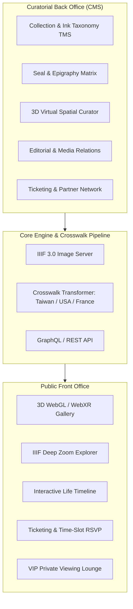

# Museum-Grade Art Curating Platform

> **A Next-Generation Digital Ecosystem for Modern & Contemporary Ink Art**  
> Tailored for Taiwanese master **Lee An-cheng (李安成)** with automated international museum standards (USA / France / Europe).

---

## Executive Summary

This platform is a unified, museum-grade digital infrastructure designed to bridge **academic cultural heritage preservation**, **immersive 3D virtual exhibition engagement**, and **international institutional exchange**.

Powered by a headless curatorial back office and high-performance front office, the system ensures fidelity to East Asian ink art traditions while maintaining complete technical compliance with global cultural repositories.

---

## Documentation Sections

| Section | Description |
| :--- | :--- |
| **[Cultural Standards & Crosswalk](standards.md)** | Taiwan Ministry of Culture (TMB 2.0 / TELDAP / NTMoFA) schemas & auto-export to USA (CDWA/VRA) and France (POP Joconde / LIDO). |
| **[System Architecture](architecture.md)** | Headless API architecture, IIIF Cantaloupe asset pipeline, and data flow. |
| **[Back-Office CMS Features](backend.md)** | Master cataloging engine, seal matrix mapper, spatial 3D room builder, editorial hub, and partner gallery tracking. |
| **[Front-Office & 3D Gallery](frontend.md)** | 60 FPS WebGL 3D virtual gallery, OpenSeadragon gigapixel deep zoom, and reservation ticketing. |
| **[Project Prerequisites](prerequisites.md)** | FADGI 4-star digitization standards, physical measurement protocols, seal decryption, and cloud infrastructure setup. |
| **[Project Management Plan](project-management.md)** | Step-by-step 28-week agile implementation roadmap, Work Breakdown Structure (WBS), and risk mitigation gates. |
| **[Strategic Innovations](innovations.md)** | AI visual similarity search (CLIP), PBR ink/paper surface shaders, and verifiable cryptographic certificates of authenticity. |
| **[Full Specification](full-spec.md)** | Single-page consolidated view of the entire technical specification. |

---

## Key Platform Highlights

!!! tip "International Interoperability"
    Enables single-click conversion between **Taiwan Cultural Memory Bank (TMB 2.0)**, **USA Smithsonian/Getty CDWA**, and **France Ministère de la Culture POP Base Joconde**.

!!! info "Native Epigraphy & Ink Taxonomy"
    Specialized cataloging for East Asian scroll mounting formats (*立軸, 橫披, 手卷, 鏡框, 冊頁*), ink wash nuances (*水墨, 設色*), seal classification (*朱文/白文*), and dual Minguo/Gregorian calendar indexing.

!!! success "Zero-Lag Gigapixel Deep Zoom"
    Powered by the **IIIF (International Image Interoperability Framework) 3.0** standard, allowing scholars and collectors to examine microscopic brushwork and paper grain smoothly on any device.
