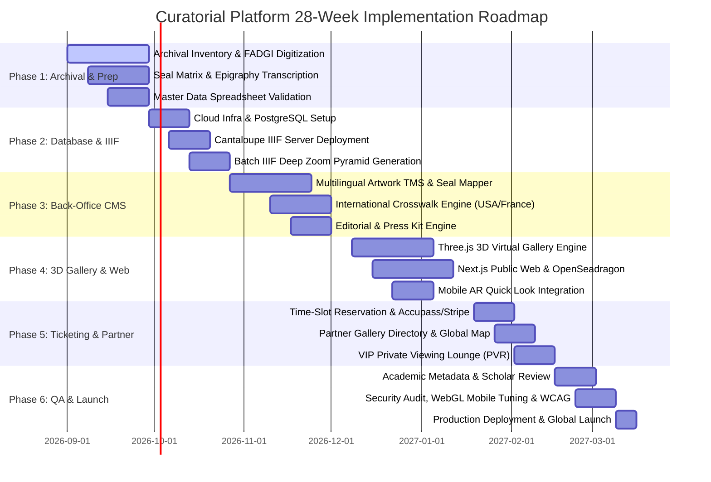

# Step-by-Step Project Management & Implementation Plan

A structured 28-week agile rollout plan divided into 6 strategic phases.

---

## 1. Project Phasing & Timeline (28-Week Schedule)

---

## 2. Phase Breakdown & Key Deliverables

### Phase 1: Archival Inventory, Digitization & Authority Setup (Weeks 1–4)
* **Milestone 1.1**: Complete physical inventory and photography of artworks following FADGI 4-star standards.
* **Milestone 1.2**: Finalize the artist Seal Matrix (印譜) and authenticate all calligraphy inscriptions.
* **Milestone 1.3**: Validate master data ingestion spreadsheets (dates, dimensions, provenance records).
* **Deliverables**: Verified master archival TIFF collection, Seal ID catalog, populated clean CSV data sheet.

### Phase 2: Core Infrastructure, Database & IIIF Asset Pipeline (Weeks 5–8)
* **Milestone 2.1**: Set up Cloud storage buckets, CDN distribution, and PostgreSQL schema.
* **Milestone 2.2**: Deploy and benchmark the Cantaloupe IIIF 3.0 image server.
* **Milestone 2.3**: Automated asset pipeline: Batch conversion of master TIFFs into Deep Zoom pyramid tiles with automated ICC color space preservation.
* **Deliverables**: Operating IIIF endpoint returning validated Image API 3.0 and Presentation API 3.0 manifests.

### Phase 3: Curatorial Back-Office CMS & Crosswalk Engine (Weeks 9–14)
* **Milestone 3.1**: Build the Collection Management System (CMS) with multilingual form inputs, seal coordinate mapper, and provenance timeline builder.
* **Milestone 3.2**: Develop the **International Crosswalk Engine** (Taiwan TMB 2.0 $\rightarrow$ USA CDWA/VRA $\rightarrow$ France POP Joconde / Europe LIDO 1.1).
* **Milestone 3.3**: Implement Editorial & News CMS with rich block editors and press kit generator.
* **Deliverables**: Fully operational Admin Back Office with Role-Based Access Control (RBAC) and 1-click XML/JSON export capabilities.

### Phase 4: 3D Virtual Gallery Builder & Public Front Office (Weeks 15–20)
* **Milestone 4.1**: Develop WebGL / Three.js 3D spatial room engine with camera navigation, lighting studio, and real-scale artwork placement.
* **Milestone 4.2**: Implement Public Web UI (Next.js / Nuxt) with OpenSeadragon IIIF Deep Zoom, faceted search, chronological timeline slider, and bilingual editorial reading room.
* **Milestone 4.3**: Integrate Mobile AR Quick Look (`.usdz` / WebXR Scene Viewer) for "View on Your Wall".
* **Deliverables**: Live staging 3D Virtual Gallery and high-speed Public Front Office.

### Phase 5: Ticketing, Partner Hub & VIP Private Viewing Rooms (Weeks 21–24)
* **Milestone 5.1**: Implement time-slot reservation module with calendar quota management and QR/Apple Wallet pass generation.
* **Milestone 5.2**: Connect external ticketing webhooks (Accupass, Eventbrite, Stripe).
* **Milestone 5.3**: Build Partner Gallery Directory with interactive Mapbox global map and consignment tracker.
* **Milestone 5.4**: Implement tokenized Private Viewing Rooms (PVR) for VIP collectors and collectors inquiry pipeline.
* **Deliverables**: End-to-end booking and VIP collector portal active on staging.

### Phase 6: QA, Security Audit, Academic Review & Global Launch (Weeks 25–28)
* **Milestone 6.1**: Academic metadata validation by East Asian art history scholars and museum registrars.
* **Milestone 6.2**: Cross-device WebGL performance optimization (ensuring 60 FPS on mobile devices and budget laptops).
* **Milestone 6.3**: Security penetration testing, rate limiting, and WCAG 2.2 accessibility compliance audit.
* **Milestone 6.4**: Production deployment, DNS cutover, and search engine indexation.
* **Deliverables**: Production launch of the platform.

---

## 3. Work Breakdown Structure (WBS) & Role Matrix

| Role | Key Responsibilities in Project |
| :--- | :--- |
| **Lead Curator & Art Historian** | Metadata verification, seal transcription, curatorial essay authoring, exhibition narrative design. |
| **Registrar / Digital Archivist** | Artwork photography supervision, physical dimension auditing, ingestion spreadsheet validation. |
| **Technical Project Manager (TPM)** | Sprint planning, cross-functional coordination, milestone tracking, risk management. |
| **Fullstack Lead / CMS Architect** | Relational DB modeling, GraphQL/REST API layer, Back-Office CMS, crosswalk export engine. |
| **3D WebGL / Graphics Engineer** | Three.js / WebGL virtual gallery engine, shader development, spatial audio, lighting optimization. |
| **Frontend UI/UX Engineer** | Public web interface (Next.js), OpenSeadragon IIIF viewer integration, ticketing & editorial views. |
| **DevOps & Cloud Engineer** | AWS/Cloudflare infrastructure, IIIF server cluster, CDN cache invalidation, automated CI/CD pipelines. |

---

## 4. Quality Gates & Risk Mitigation Strategies

| Risk Factor | Probability / Impact | Preventative Mitigation Strategy |
| :--- | :--- | :--- |
| **Inaccurate Epigraphy & Seal Misidentification** | Medium / High | Mandatory two-scholar peer review for all seal transcriptions before locking database records. |
| **Gigapixel Image Latency & Bandwidth Costs** | High / High | Cloudflare edge caching for all IIIF `.dzi` tiles; pre-generated static tile caches for key collection highlights. |
| **WebGL Performance Lag on Mobile Devices** | High / Medium | Level-of-Detail (LOD) texture swapping, Draco geometry compression, dynamic resolution scaling, and 2D fallback mode. |
| **Metadata Incompatibility with Overseas Museums** | Medium / High | Built-in XSD schema validation tests against official CDWA, LIDO, and POP Joconde XML schemas during CI/CD. |
| **Ticketing Quota Race Conditions** | Low / High | Atomic Redis transactions with distributed locks to prevent double-booking during peak reservation surges. |
