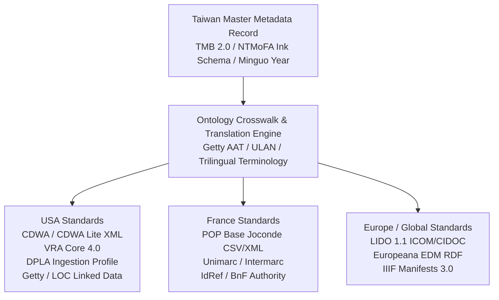

# Cultural Heritage Standards & International Crosswalk Engine

The curating platform natively integrates **Taiwanese cultural heritage data standards** while providing an automated **Ontology Crosswalk & Export Engine** for major international museum repositories in the **United States** and **France / Europe**.

---

## 1. Taiwan National Cultural Standards & Art Conventions

Because the platform represents Taiwanese modern and contemporary ink masters (such as **Lee An-cheng 李安成**), the core database schema complies with Taiwan Ministry of Culture guidelines and traditional East Asian cataloging ontologies:

### Key Taiwan Standards
* **Taiwan Cultural Memory Bank 2.0 (國家文化記憶庫 2.0 - TMB / 文化部 MOC)**:
  * Full schema compliance for cultural artifact description, metadata exchange, OpenAPI interoperability, and standard Taiwanese Public Cultural Licensing / Creative Commons frameworks.
* **TELDAP (數位典藏與數位學習國家型科技計畫) Metadata Standards**:
  * Adherence to Taiwan’s foundational National Digital Archives guidelines for visual arts and calligraphy metadata structures.
* **Museum of Fine Arts Cataloging Frameworks (NTMoFA 國美館 / TFAM 北美館 / KMFA 高美館)**:
  * **Medium & Support Taxonomy**: Native classification for 水墨 (Ink and wash), 彩墨 (Color and ink), 設色 (Color wash), 礦物顏料 (Mineral pigments), 宣紙 (Xuan paper), 棉紙 (Cotton paper), 絹本 (Silk), 複合媒材 (Mixed media).
  * **Mounting & Format Typology (裝裱形制)**: 條幅/立軸 (Hanging scroll), 橫披 (Horizontal scroll), 手卷 (Handscroll), 鏡框/鏡心 (Framed / mounted core), 冊頁 (Album leaf), 屏風 (Folding screen), 捲軸 (Rolled scroll).
  * **Epigraphy, Inscriptions & Seals (款識與印章)**:
    * Inscription transcriptions (題款/詩跋), calligraphy script styles (行草, 隸書, 楷書), and normalized coordinate location mapping.
    * Seal imprint records (鈐印): Distinction between 朱文 (Yang/Relief seal) and 白文 (Yin/Intaglio seal), Name seals (姓名印), Pseudonym/Studio seals (字號印), and Leisure/Aesthetic seals (閒章/押角章).
  * **Dual Calendar System**: Native indexing supporting Taiwanese Minguo Era (民國年, e.g., 民國69年), Gregorian Solar Year (1980), and Sexagenary Cycle (干支紀年, e.g., 庚申年).
  * **Authority Control & Romanization**:
    * Dual Romanization mapping: Wade-Giles (*Lee An-cheng* / *Li An-cheng*) $\leftrightarrow$ Hanyu Pinyin (*Lǐ Ānchéng*) $\leftrightarrow$ Traditional Chinese (*李安成*).
    * Linked authority URIs with the **National Central Library Authority Database (國家圖書館權威檔)** and **Academia Sinica Center for Digital Cultures (中研院數位文化中心 CCC)**.

---

## 2. International Standard Export Pipelines (USA & France / Europe)

The platform features an automated **Crosswalk Transformation Engine** that converts Taiwan-native curatorial records into international museum formats at the touch of a button:

### A. Export to United States (USA) Standards
* **CDWA & CDWA Lite (Categories for the Description of Works of Art - Getty/Smithsonian)**:
  * Maps Taiwanese physical descriptions, measurements, and inscriptions to standard Getty CDWA XML elements (`cdwalite:indexingMaterialsTech`, `cdwalite:inscriptions`, `cdwalite:provenanceDescription`).
* **VRA Core 4.0 (Visual Resources Association)**:
  * Full XML export for US academic and museum visual resource centers, packaging work records, image surrogate records, and collection relationships.
* **DPLA Ingestion Format (Digital Public Library of America)**:
  * Qualified Dublin Core (QDC) export ready for harvesting by US national cultural aggregators.
* **Getty Vocabularies & US Library of Congress Alignment**:
  * Automated term reconciliation mapping Chinese medium/format concepts to Getty AAT URIs (e.g., 立軸 $\rightarrow$ AAT `300015012` [hanging scrolls]; 水墨 $\rightarrow$ AAT `300053271` [ink wash]).

### B. Export to France & European Standards
* **POP - Base Joconde (Ministère de la Culture, France)**:
  * Automated generation of official French museum inventory records following the *Joconde* cataloging syntax:
    * `AUTR` (Auteur / Artist): *LEE An-cheng (李安成)*
    * `TITR` (Titre de l'œuvre): Translated French title & romanized original
    * `DENO` (Dénomination): *Peinture / Rouleau vertical* (Hanging scroll)
    * `TECH` (Techniques & Matériaux): *Encre de Chine et couleur sur papier de riz (Xuan)*
    * `DIM` (Dimensions): *H. en cm ; L. en cm*
    * `PERI` (Époque / Période): *4e quart 20e siècle (1980)*
    * `INS` (Inscriptions / Signatures): Transcribed and translated artist seals (*Sceau de l'artiste en bas à droite*)
    * `STAT` (Statut juridique): Ownership, copyright, and inventory number.
* **LIDO 1.1 (Lightweight Information Describing Objects - ICOM / CIDOC)**:
  * The international XML harvesting standard for European museum portals and Franco-German digital archives.
* **Europeana Data Model (EDM)**:
  * Semantic RDF/XML and JSON-LD data structure ready for direct ingestion into the European cultural platform **Europeana**.
* **IdRef & BnF (Bibliothèque nationale de France) Identifier Linking**:
  * Semantic links to French national authority files and international ISNI/ORCID identifiers.

---

## 3. Trilingual Terminology Crosswalk Reference

| Chinese Term (Traditional) | English Museum Equivalent | French Equivalent (*Base Joconde*) | Getty AAT URI |
| :--- | :--- | :--- | :--- |
| **水墨 (水墨畫)** | Ink wash / Chinese ink painting | Peinture à l'encre de Chine | `aat:300053271` |
| **水墨設色 / 彩墨** | Ink and color on paper | Encre et couleurs sur papier | `aat:300053271` |
| **立軸 / 條幅** | Hanging scroll | Rouleau vertical / Kakemono | `aat:300015012` |
| **橫披** | Horizontal scroll | Rouleau horizontal | `aat:300189808` |
| **手卷** | Handscroll | Rouleau portatif / Makimono | `aat:300015014` |
| **鏡心 / 鏡框** | Mounted in frame / Unmounted core | Peinture montée sous cadre | `aat:300055644` |
| **冊頁** | Album leaf | Feuille d'album | `aat:300027354` |
| **朱文姓名印** | Artist relief seal (Zhuwen) | Sceau nominatif de l'artiste en relief | `aat:300028744` |
| **白文印** | Intaglio seal (Baiwen) | Sceau en creux (caractères blancs) | `aat:300028744` |
| **宣紙** | Xuan paper / Rice paper | Papier de riz (Xuan) | `aat:300014163` |
